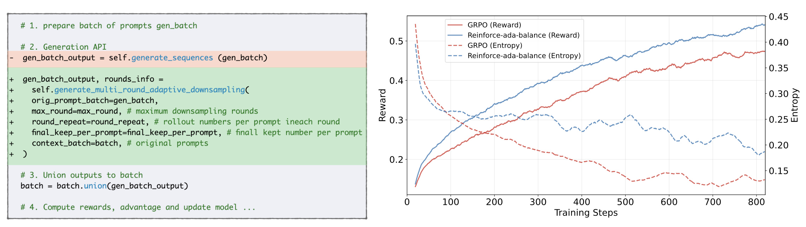
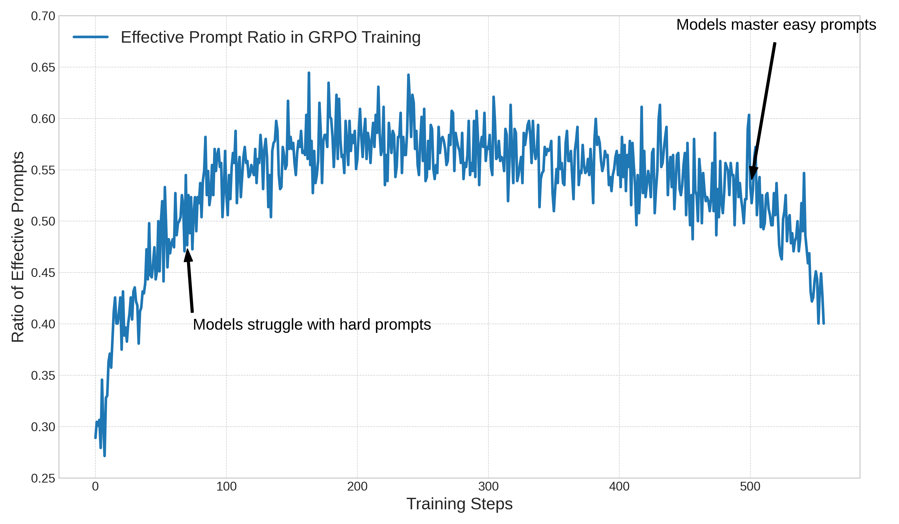
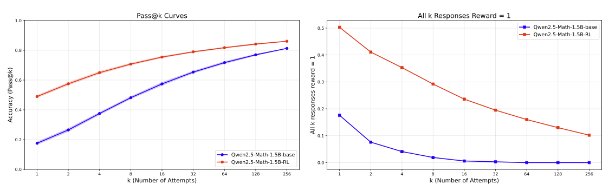
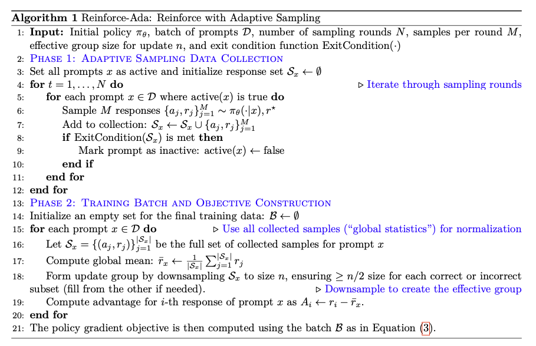

<div align="center">

# Reinforce-Ada: An Adaptive Sampling Framework for Reinforce-Style LLM Training
[](https://arxiv.org/pdf/2504.11343) [](https://github.com/RLHFlow/Reinforce-Ada)
</div>


## 📢 Introduction
This repository contains the official implementation for Reinforce-Ada, an adaptive sampling framework designed to resolve the ``signal collapse'' problem in Reinforce-style algorithm with group baseline such as GRPO, making training more efficient and effective.


<p align="center">
  
</p>
<i><b>Figure 1:</b> Left: Adaptive sampling can be used with one-line swap of the generation API in verl. Right: Reinforce-Ada significantly improves training efficiency and final performance compared to standard GRPO.</i>
</p>


### 🧐 The Challenge: Signal Collapse in GRPO
Group Relative Policy Optimization (GRPO) is a widely-used algorithm in Reinforcement Learning from Verifiable Reward (RLVR). It calculates the advantage by normalizing rewards within a group of n responses:
$$g_\theta(x,a) =  \frac{r_i - \bar{r}}{\sigma_r + \varepsilon} \cdot \nabla_\theta \log \pi_\theta(a|x).$$

While effective, GRPO suffers from a critical flaw in practice: **signal collapse**. When all n samples for a prompt yield the same reward (e.g., all correct or all incorrect), **the gradient is zero** for all the responses and there is no learning signal for this prompt.


<p align="center">
  
</p>
<i><b>Figure 2:</b> The proportion of prompts with zero gradient (uniform rewards) remains high during training.</i>

This isn't a minor issue. It frequently occurs early in training (when models fail on hard prompts) and later in training (when models master easy ones). Crucially, this is a **statistical artifact of undersampling**, not a sign that the prompts are useless. A larger sample size n would often reveal a mix of correct and incorrect answers, unlocking a valid learning signal. For instance, the RL trained model exhibits 35.3\% all-correct groups at n=4, but only 10.2\% at n=256. These results demonstrate that the missing signal is often recoverable with larger n, confirming that uniform-reward collapse is a sampling artifact rather than a model limitation.  

<p align="center">
  
</p>

<i><b>Figure 3:</b> Increasing sample size (pass@k) reveals the model's true capability, confirming that signals are often recoverable.</i>
</p>

However, uniformly increasing n for all prompts is computationally prohibitive. Seminal works like DeepSeek-R1 show that a small group size (e.g., n=16) is sufficient for an effective gradient update. This reveals a gap between the large inference budget needed to find a signal and the smaller update budget needed to learn from it.


### ✨ Our Solution Reinforce-Ada: Reinforce with Adaptive Sampling
To bridge this gap, we introduce Reinforce-Ada, an adaptive sampling framework that intelligently allocates the inference budget. Instead of a fixed n, our algorithm samples in rounds, deactivating prompts once a sufficient learning signal is found. This frees up computation, allowing difficult prompts to be sampled more deeply until a useful signal emerges.


<p align="center">
  
</p>

<i><b>Algorithm 1:</b> The Reinforce-Ada framework.</i>
</p>

Our framework consists of three core ideas:

1. **Adaptive Sampling**: A successive elimination process that eliminates prompts with sufficient learning signals and keeps sampling the unsolved prompts.
2. **Principled Exit Conditions**: Flexible rules (Reinforce-Ada-pos, Reinforce-Ada-balance) to determine when a prompt is resolved, balancing signal diversity and sampling efficiency.
3. **Robust Advantage Calculation**: We compute the advantage baseline $(r_i-\bar{r})$ using statistics from the entire pool of responses generated for a prompt, not just the final down-sampled batch, leading to more stable estimates.

### Key Results
Our experiments show that Reinforce-Ada consistently improves sample efficiency and final model performance across various models and benchmarks.

| Model | Algorithm | **Math500** | **Minerva Math** | **Olympiad Bench** | **AIME-like** | **Weighted Average** |
| :--- | :--- | :--- | :--- | :--- | :--- | :--- |
| *Qwen2.5-Math-1.5B* | GRPO | 74.2 | 34.4 | 38.4 | 16.2 | 45.3 |
| *Qwen2.5-Math-1.5B* | Reinforce-Ada-pos | 75.8 | 35.7 | 38.6 | 16.5 | 46.1 |
| *Qwen2.5-Math-1.5B* | **Reinforce-Ada-balance** | 77.4 | 36.5 | 40.5 | 17.5 | **47.6 (+2.3)** |
|:---|:---|:---|:---|:---|:---|:---|
| *Qwen2.5-Math-1.5B (hard)* | GRPO | 71.0 | 31.8 | 34.3 | 13.8 | 41.9 |
| *Qwen2.5-Math-1.5B (hard)* | Reinforce-Ada-pos | 73.9 | 33.1 | 36.4 | 16.4 | 44.6 |
| *Qwen2.5-Math-1.5B (hard)* | **Reinforce-Ada-balance** | 74.7 | 33.7 | 38.7 | 17.6 | **45.5 (+3.6)** |
|:---|:---|:---|:---|:---|:---|:---|
| *Qwen2.5-Math-7B* | GRPO | 82.2 | 44.7 | 45.6 | 23.2 | 53.3 |
| *Qwen2.5-Math-7B* | Reinforce-Ada-pos | 82.7 | 45.1 | 46.7 | 23.7 | 54.2 |
| *Qwen2.5-Math-7B* | **Reinforce-Ada-balance** | 84.0 | 45.2 | 47.1 | 23.7 | **54.6 (+1.3)** |
|:---|:---|:---|:---|:---|:---|:---|
| *Qwen2.5-Math-7B (hard)* | GRPO | 80.7 | 42.8 | 42.9 | 21.8 | 51.3 |
| *Qwen2.5-Math-7B (hard)* | Reinforce-Ada-pos | 82.4 | 43.1 | 45.0 | 22.2 | 52.8 |
| *Qwen2.5-Math-7B (hard)* | **Reinforce-Ada-balance** | 83.1 | 43.4 | 46.4 | 24.9 | **53.9 (+2.6)** |
|:---|:---|:---|:---|:---|:---|:---|
| *LLaMA-3.2-3B-instruct* | GRPO | 51.7 | 20.5 | 20.4 | 7.2 | 27.9 |
| *LLaMA-3.2-3B-instruct* | Reinforce-Ada-pos | 52.6 | 22.2 | 21.0 | 7.5 | 28.8 |
| *LLaMA-3.2-3B-instruct* | **Reinforce-Ada-balance** | 53.2 | 22.4 | 21.2 | 8.0 | **29.1 (+1.2)** |

> **Table Notes**: The value `(+X.X)` indicates the improvement in Weighted Average score over the GRPO baseline for each model group.
**Table 1**:
> Performance comparison of GRPO and Reinforce-Ada. We report average@32 accuracy with a sampling temperature of 1.0 and a maximum generation length of 4096 tokens. The weighted average score is computed according to the number of prompts in each benchmark. "Hard" indicates training on a more challenging prompt set, with details provided in the paper.


## 🌍 Environment Setup
1. Create a new environment.
   ```bash
   python -m venv ~/.python/reinforce_ada
   source ~/.python/reinforce_ada/bin/activate

   # You can also use conda 
   #conda create -n reinforce_ada python==3.10
   #conda activate reinforce_ada
   ```
2. Install dependencies
   ```bash
   pip install pip --upgrade
   pip install uv
   python -m uv pip install torch==2.6.0 --index-url https://download.pytorch.org/whl/cu124
   python -m uv pip install flash-attn --no-build-isolation
   git clone https://github.com/RLHFlow/Reinforce-Ada.git
   cd ./Reinforce-Ada
   python -m uv pip install -e .
   python -m uv pip install vllm==0.10.1
   ```

## 🧪 Experiments Running
1. Prepare the training and test datasets
    ```bash
    bash scripts/prepare_data.py  # adjust pass_rate to 0.125 and 0.313 for hard and easy prompt selection
    ```
2. Start the training loop.
   ```bash
   bash scripts/run_reinforce_ada.sh  # Chcek this file for more details
   ```
3. Evaluation
   ```bash
   bash scripts/eval_model.sh  # Chcek this file for more details
   ```

## 🙏 Acknowledgement
We thanks [verl](https://github.com/volcengine/verl) for providing the awesome training codebase, and [Qwen2.5-Math](https://github.com/QwenLM/Qwen2.5-Math) for its robust grader.

## 📝 Citation
If you find our paper and code helpful, feel free to give us a citation.
```bibtex
@article{reinforceada,
  title={Reinforce-Ada: An Adaptive Sampling Framework for Reinforce-Style LLM Training},
  author={Wei Xiong, Chenlu Ye, Baohao Liao, Hanze Dong, Xinxing Xu, Christof Monz, Jiang Bian, Nan Jiang, Tong Zhang},
  year={2025}
}
```